# 문서화 도구 및 자동화

**문서 버전**: 1.0
**최종 수정일**: 2025-11-11
**상태**: Active

---

## 개요

8G 프로젝트 문서 작성 및 유지보수에 사용하는 도구와 자동화 스크립트를 정의합니다.

---

## 권장 도구

### 마크다운 에디터

#### VS Code + Markdown All in One 확장
**장점**:
- 실시간 프리뷰
- 자동 목차 생성
- 링크 자동완성
- Lint 통합

**설치 방법**:
```bash
code --install-extension yzhang.markdown-all-in-one
```

**주요 단축키**:
- `Cmd+Shift+V`: 프리뷰
- `Cmd+K V`: 사이드바 프리뷰
- `Ctrl+Shift+[`: 접기
- `Ctrl+Shift+]`: 펼치기

---

#### Typora (WYSIWYG)
**장점**:
- 즉시 렌더링
- 직관적 인터페이스
- 테이블 편집 용이

**다운로드**: https://typora.io/

---

### 다이어그램 도구

#### Mermaid (코드 기반)
**장점**:
- 코드로 관리 가능
- Git diff 가능
- 자동 레이아웃

**예시**:

```mermaid
graph LR
  A[워크플로우 빌더] --> B[데이터베이스]
  B --> C[Extension SDK]
  C --> D[브라우저]
```


**문법 학습**: https://mermaid.js.org/

---

#### draw.io (비주얼)
**장점**:
- 드래그 앤 드롭
- 다양한 템플릿
- PNG/SVG 내보내기

**사용 방법**:
1. https://app.diagrams.net/ 접속
2. 다이어그램 작성
3. Export as PNG
4. `docs/images/` 폴더에 저장

---

### 문서 검증 도구

#### markdownlint
**목적**: 마크다운 문법 검증

**설치**:
```bash
pnpm add -D markdownlint-cli
```

**실행**:
```bash
pnpm run lint:docs
```

**설정 파일** (`.markdownlint.json`):
```json
{
  "default": true,
  "MD013": false,
  "MD033": false
}
```

---

#### 줄 수 카운터
**목적**: 문서 길이 체크 (200줄 정책)

**스크립트** (`scripts/check-doc-length.sh`):
```bash
#!/bin/bash

MAX_LINES=200
VIOLATIONS=0

echo "📊 문서 길이 체크 (최대 ${MAX_LINES}줄)"
echo "================================"

for file in .claude/**/*.md; do
  if [[ -f "$file" ]]; then
    lines=$(wc -l < "$file")

    if [ "$lines" -gt "$MAX_LINES" ]; then
      echo "❌ $file: ${lines}줄 (+$((lines - MAX_LINES)))"
      VIOLATIONS=$((VIOLATIONS + 1))
    else
      echo "✅ $file: ${lines}줄"
    fi
  fi
done

echo "================================"
echo "총 위반: ${VIOLATIONS}개"

exit $VIOLATIONS
```

**실행**:
```bash
chmod +x scripts/check-doc-length.sh
./scripts/check-doc-length.sh
```

---

## 자동화 스크립트

### 1. 문서 줄 수 체크

**목적**: CI/CD에서 200줄 정책 자동 검증

**package.json 추가**:
```json
{
  "scripts": {
    "docs:check-length": "bash scripts/check-doc-length.sh"
  }
}
```

**실행**:
```bash
pnpm run docs:check-length
```

---

### 2. 링크 유효성 검증

**목적**: 깨진 링크 자동 감지

**스크립트** (`scripts/check-doc-links.sh`):
```bash
#!/bin/bash

echo "🔗 문서 링크 유효성 검사"
echo "================================"

find .claude -name "*.md" -exec grep -H -o '\[.*\](.*\.md)' {} \; | while read -r match; do
  file=$(echo "$match" | cut -d: -f1)
  link=$(echo "$match" | grep -o '(.*\.md)' | tr -d '()')

  # 상대 경로 처리
  dir=$(dirname "$file")
  target="$dir/$link"

  if [[ ! -f "$target" ]]; then
    echo "❌ 깨진 링크: $file → $link"
  fi
done

echo "================================"
echo "검사 완료"
```

**실행**:
```bash
chmod +x scripts/check-doc-links.sh
./scripts/check-doc-links.sh
```

---

### 3. 오래된 문서 리포트

**목적**: 3개월 이상 업데이트 안 된 문서 자동 탐지

**스크립트** (`scripts/stale-docs-report.sh`):
```bash
#!/bin/bash

echo "📅 오래된 문서 리포트 (90일 이상)"
echo "================================"

find .claude -name "*.md" -mtime +90 -exec ls -lh {} \; | awk '{print $9, "("$6, $7, $8")"}'

echo "================================"
```

**실행**:
```bash
chmod +x scripts/stale-docs-report.sh
./scripts/stale-docs-report.sh
```

---

### 4. 문서 메타데이터 검증

**목적**: 필수 필드 누락 확인

**스크립트** (`scripts/check-doc-metadata.sh`):
```bash
#!/bin/bash

echo "📋 문서 메타데이터 검증"
echo "================================"

for file in .claude/product-specs/F-*.md; do
  if [[ -f "$file" ]]; then
    # 기능 ID 체크
    if ! grep -q "^**기능 ID**:" "$file"; then
      echo "❌ $file: 기능 ID 누락"
    fi

    # 최종 수정일 체크
    if ! grep -q "^**최종 수정일**:" "$file"; then
      echo "❌ $file: 최종 수정일 누락"
    fi

    # 상태 체크
    if ! grep -q "^**상태**:" "$file"; then
      echo "❌ $file: 상태 누락"
    fi
  fi
done

echo "================================"
```

---

## CI/CD 통합

### GitHub Actions 예시

**파일**: `.github/workflows/docs-check.yml`

```yaml
name: Documentation Check

on:
  pull_request:
    paths:
      - '.claude/**/*.md'

jobs:
  check-docs:
    runs-on: ubuntu-latest

    steps:
      - uses: actions/checkout@v3

      - name: Check document length
        run: bash scripts/check-doc-length.sh

      - name: Check broken links
        run: bash scripts/check-doc-links.sh

      - name: Check metadata
        run: bash scripts/check-doc-metadata.sh

      - name: Lint markdown
        run: |
          npm install -g markdownlint-cli
          markdownlint '.claude/**/*.md'
```

---

## 참고 문서

- **상위 문서**: [문서화 원칙](../DOCUMENTATION_PRINCIPLES.md)
- **관련 문서**:
  - [작성 가이드라인](./writing-guidelines.md)
  - [유지보수 가이드](./maintenance.md)

---

**작성자**: Product Team & Engineering Team
**리뷰 주기**: 분기별
