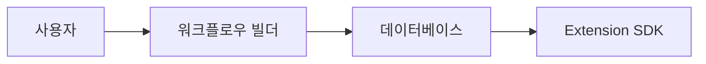
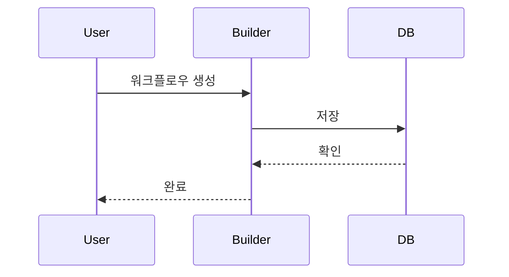

# 문서 작성 가이드라인

**문서 버전**: 1.0
**최종 수정일**: 2025-11-11
**상태**: Active

---

## 개요

8G 프로젝트 문서 작성 시 반드시 따라야 할 작성 규칙과 베스트 프랙티스를 정의합니다.

---

## 1. 명확한 제목 사용

### 규칙

- 제목은 내용을 명확히 설명해야 함
- 모호한 단어 지양 (예: "설정", "기타")
- 구체적 명사 사용

### 예시

```markdown
❌ 나쁜 예:

## 설정

✅ 좋은 예:

## 워크플로우 실행 설정
```

```markdown
❌ 나쁜 예:

## 사용법

✅ 좋은 예:

## 블록 추가 및 연결 방법
```

---

## 2. 코드 예시 포함

### 규칙

- 모든 기술 설명에는 실제 코드 예시 포함
- 코드 블록에 언어 명시 필수
- 주석으로 핵심 포인트 표시

### 예시

```markdown
✅ 좋은 예:

## 블록 설정 방법

다음과 같이 `get-text` 블록을 설정할 수 있습니다:

\`\`\`typescript
const block = {
name: "get-text",
selector: ".title",
findBy: "cssSelector"
};
\`\`\`
```

```markdown
✅ 주석 포함:
\`\`\`typescript
// 워크플로우 JSON 생성
const workflow = buildWorkflowJson(nodes, edges);

// Extension으로 실행
await EightGClient.collectWorkflow({
targetUrl: "https://example.com",
workflow
});
\`\`\`
```

---

## 3. 시각 자료 활용

### Mermaid 다이어그램

**플로우차트**:



**시퀀스 다이어그램**:



### 표를 활용한 비교

```markdown
| 블록 타입   | 용도        | 예시        |
| ----------- | ----------- | ----------- |
| get-text    | 텍스트 추출 | 제목, 가격  |
| event-click | 클릭 이벤트 | 버튼, 링크  |
| wait        | 대기        | 페이지 로딩 |
```

---

## 4. 체크리스트 제공

### 규칙

- 실행 가능한 작업 단위로 나누기
- 순서가 있다면 번호 매기기
- 상태 추적 가능하게 체크박스 사용

### 예시

```markdown
✅ 실행 가능한 체크리스트:

### 워크플로우 생성 전 확인사항

- [ ] 브라우저 확장 설치됨
- [ ] 타겟 URL 설정됨
- [ ] 변수 정의됨
- [ ] 첫 번째 블록 선택됨
```

```markdown
✅ 순차 작업 체크리스트:

### 워크플로우 배포 절차

1. [ ] 로컬 테스트 완료
2. [ ] JSON 검증 통과
3. [ ] 데이터베이스 저장
4. [ ] Extension 연동 테스트
5. [ ] 프로덕션 배포
```

---

## 5. 링크 명확히 표시

### 규칙

- 링크 텍스트에 목적 명시
- "여기", "클릭" 같은 모호한 표현 금지
- 상대 경로 사용 권장

### 예시

```markdown
✅ 좋은 예:
상세한 블록 타입 정보는 [블록 시스템 명세서](./F-002-block-system.md)를 참조하세요.

❌ 나쁜 예:
[여기](./F-002-block-system.md)를 클릭하세요.
```

```markdown
✅ 섹션별 링크:

- **기획 단계**: [PRD](../PRD.md) 참조
- **개발 단계**: [기능 명세서](../product-specs/README.md) 참조
- **배포 단계**: [배포 가이드](../guides/deployment.md) 참조
```

---

## 참고 문서

- **상위 문서**: [문서화 원칙](../DOCUMENTATION_PRINCIPLES.md)
- **관련 문서**: [리뷰 체크리스트](./review-checklist.md)

---

**작성자**: Product Team & Engineering Team
**리뷰 주기**: 분기별
