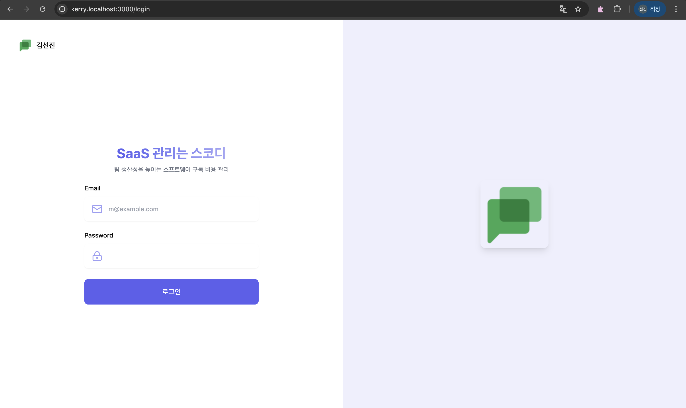
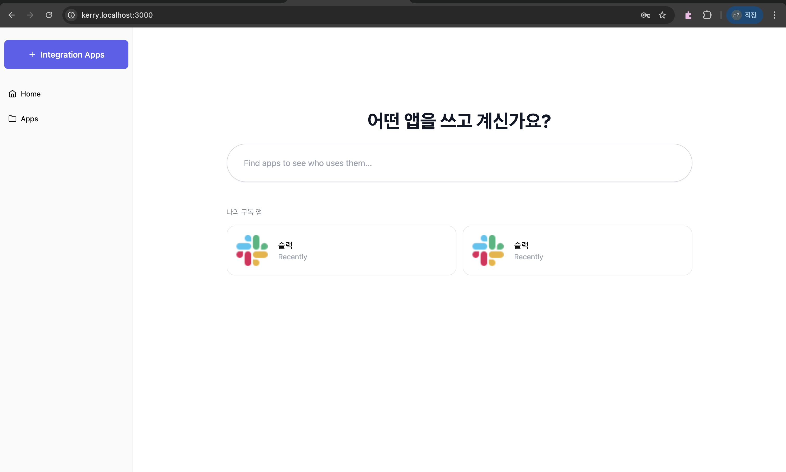
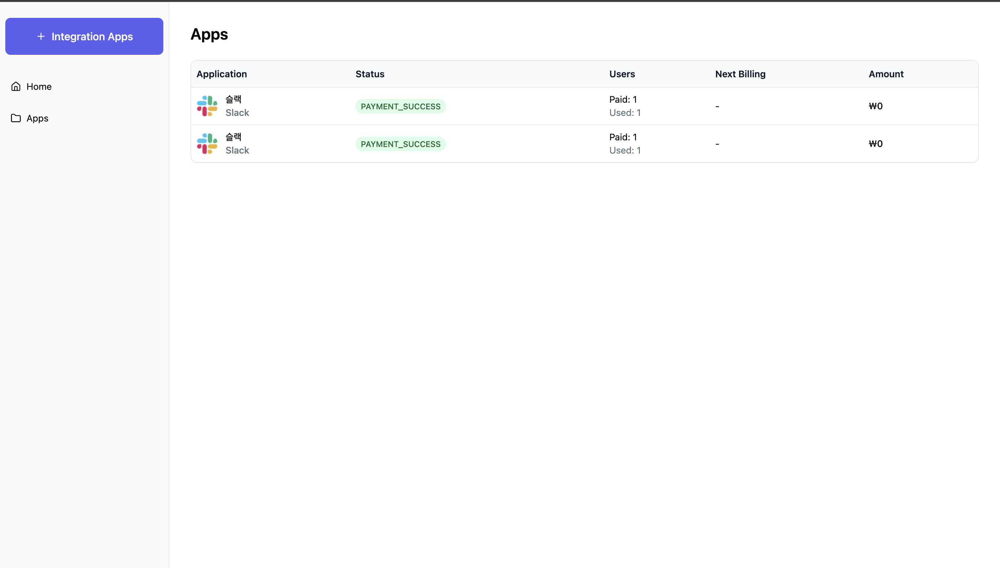
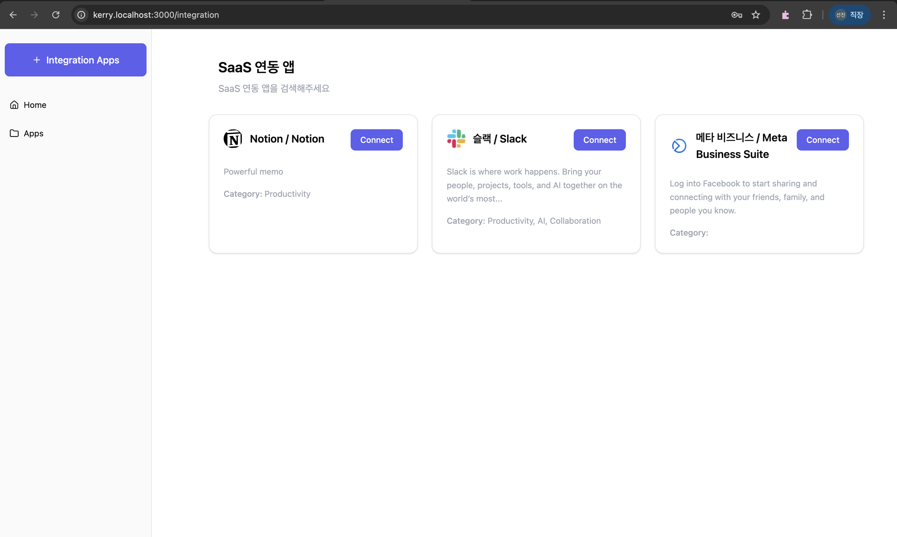
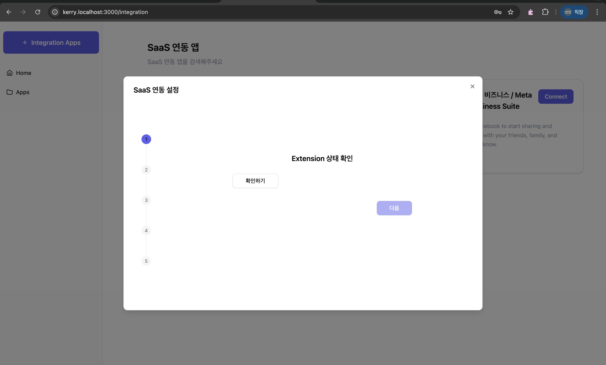
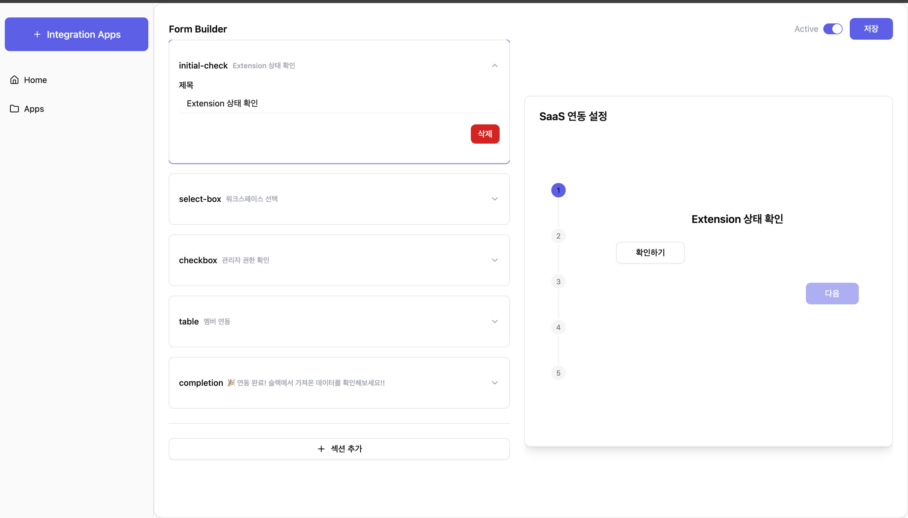
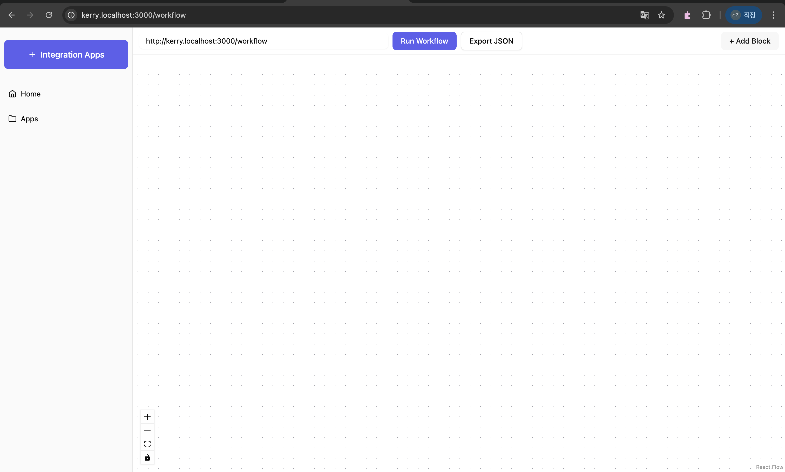
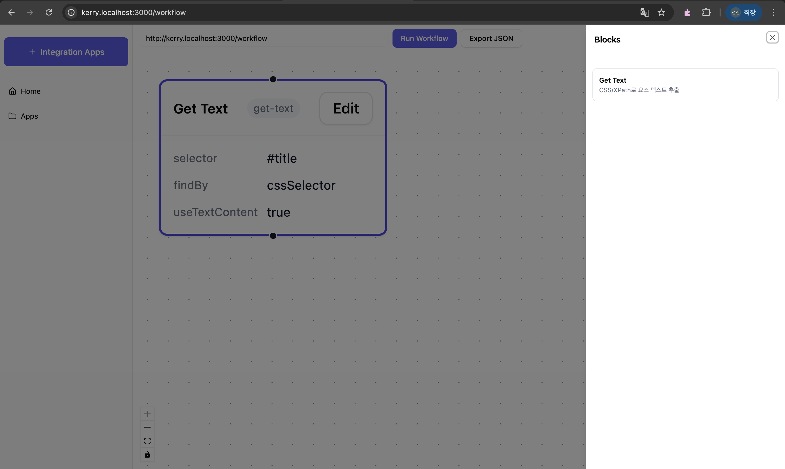

# 8G 서비스에 오신걸 환영합니다!!

## How To Run

### 1. 해당 Repo를 pull 받습니다.

```bash
git clone https://github.com/01Republic/8g.git

git pull
```

### 2. .env 파일을 만들고 아럐 값을 입력해주세요 (기존 scodi-api와 동일)

```.env
DB_HOST=localhost
DB_PORT=3306
DB_USER=myuser
DB_PASSWORD=mypassword
DB_NAME=mydb
```

### 3. 그리고 migration를 따로 추가하지 않았기 때문에 아래 쿼리 들로 해당 패키지에 필요한 테이블을 만듭니다

- 이 부분은 차후 논의 필요 / 테이블 이름 및 마이그레이션 여부 등등

```sql
CREATE TABLE IF NOT EXISTS integration_app_form_metadata (
  id INT NOT NULL AUTO_INCREMENT,
  product_id INT NOT NULL,
  meta JSON NOT NULL,
  is_active BOOLEAN NOT NULL DEFAULT FALSE,
  PRIMARY KEY (id),
  UNIQUE KEY uq_integration_app_form_metadata_product_id (product_id)
) ENGINE=InnoDB DEFAULT CHARSET=utf8mb4 COLLATE=utf8mb4_unicode_ci;
```

### 4. pnpm을 사용해서 실행

```bash
pnpm run dev
```

## 가이드

### 1. 로그인 {subdomain}.localhost:3000/login

우선 기본적으로 8g는 scodi user & org 테이블을 같이 씁니다. 그리고 개인 서비스라기 보단 조직 단위 서비스 이기 때문에 slug를 활용해서 subdomain url을 제공합니다! 따라서 org의 slug를 알아야합니다!! 이 부분은 데이터베이스의 organizations의 slug 컬럼을 확인해주세요!

- (추가로 slug는 현재 스코디 내에서 수정할 수 없어서 디비로 확인해야합니다. 또는 {name}-{id} 방식으로 자동 생성되기 때문에 그거로 해주셔도 됩니다.)
- 그리고 subdomain은 영어로만 해야합니다
- 멀티 테넌트 방식

그러면 아래와 같이 로그인 화면이 뜹니다.


### 2. 홈 화면 {subdomain}.localhost:3000

로그인 후에는 다음과 같이 홈 화면으로 이동합니다. 여기서는 내가 등록한 앱(scordi api에서는 subscription 개념)을 보여주고 검색할 수 있습니다.
검색 결과는 아래의 나의 구독 앱 쪽에서 카드 형식으로 보여주게 됩니다.

- 추가로 현재 카드에 product 이름과 아이콘 등을 보여주는데, 이렇게 보여주면 어떤 구독인지 알 수 없어서 추가 정보를 보여주는 것이 필요



### 3. 앱 화면 {subdomain}.localhost:3000/apps

좌측에 apps 버튼을 클릭하면 이동하는 페이지로 내가 등록한 앱(subscription) 리스트를 보여줍니다.
클릭하면 모달이나 새 탭으로 정보를 보여줘야하는데 아직 어떤 정보를 보여줘야할 지 정해지지 않아서 따로 구현이 되지 않았습니다.


### 4. 연동 화면 {subdomain}.localhost:3000/integration

왼쪽 상단의 + integration apps 버튼을 클릭하면 나오는 화면으로 실제 연동이 가능한 product가 나오게 됩니다.
여기서 나오는 product는 scordi의 product table에서 가져오는 거고 여기 프로젝트에서 새로 만든 테이블 integration_app_form_metadata 에서 is_active 가 true인 것들을 가져와서 거기에 있는 product id 들로 가져옵니다



그리고 Connect 버튼을 클릭하면 integration_app_form_metadata에 있는 metadata로 폼 모달을 띄워서 연동을 진행하게 됩니다.



### 5. 폼 빌더 화면 {subdomain}.localhost:3000/apps/{product_id}/form-builder



Connect 버튼을 클릭했을 때 나오는 폼 모달를 설정할 수 있는 페이지 입니다. 각 모달의 순서 및 화면을 섹션이라 정의했고, 섹션을 추가할 때 마다 스텝이 추가 됩니다.

각 섹션의 타이틀과 여러 값을 수정할 수 있고, workflow를 수정할 수 있습니다.
다만 아직 워크플로우 입력 쪽은 구현이 덜 되어 있어서 아직 동작하지 않습니다! 차후 workflow 페이지를 활용하여 구축할 예정입니다.

마지막으로 실제 integration apps에서 보여주기 위해선 우측 상단의 Active 토글을 킨 후 저장 버튼을 클릭해주시면 실제로 반영이 되서 보입니다.

### 6. 워크플로우 화면



워크플로우를 만들 수 있는 화면우로 우측 상단의 add block을 클릭하면 실제 drag and drop 방식으로 노드 끼리 연결해서 실제 크롤링을 할 수 있는 워크플로우를 만들 수 있습니다.



실제 Run workflow을 클릭하면 실행이 되며 상단에 있는 url이 타겟 url이 되서 동작하게 됩니다.

## 프로젝트 구조

### 전체 구조 한눈에

```bash
.
├─ app/                      # 앱 소스 (Remix/React)
│  ├─ assets/                # 정적 리소스 헬퍼
│  ├─ client/                # 라우트별 클라이언트 뷰 레이어
│  │  ├─ admin/              # 폼/워크플로우 빌더 등 관리 도구
│  │  ├─ private/            # 로그인 이후 화면(Home, Apps, Integration 등)
│  │  └─ public/             # 로그인 이전 화면(Login 등)
│  ├─ components/            # 공용 컴포넌트(shadcn 기반 UI 포함)
│  ├─ hooks/                 # 커스텀 훅
│  ├─ layouts/               # 레이아웃 컴포넌트
│  ├─ lib/                   # 유틸리티
│  ├─ middleware/            # 클라이언트/라우트 미들웨어(auth 등)
│  ├─ models/                # 도메인 로직(Integration/Workflow 등)
│  ├─ routes/                # Remix 라우트 엔드포인트
│  ├─ root.tsx               # 앱 엔트리
│  ├─ routes.ts              # React Router 라우트 설정 (파일 기반 → Config 기반 전환)
│  └─ session.ts             # 세션 유틸
├─ public/                   # 정적 파일 루트(파비콘 등)
├─ build/                    # 빌드 결과물
├─ components.json           # shadcn/ui 구성
├─ vite.config.ts            # Vite 설정
└─ tsconfig.json             # TS 설정
```

### 라우팅 & 페이지

- **라우트 엔트리**는 `app/routes.ts`에서 레이아웃 기반으로 선언합니다. 공통 레이아웃(`layouts/sidebar`, `layouts/common`)에 따라 child 라우트가 묶입니다.
- **라우트 구현체**는 `app/routes/*.tsx`에 위치하며, 여기서 메타/loader/action 등을 정의합니다.
- **클라이언트 전용 페이지**는 `app/client`에 분리해 둡니다. Remix 라우트 파일에서는 이 컴포넌트를 불러와 구성만 합니다.
- **로그인 이후 화면**은 `app/client/private`, **로그인 이전 화면**은 `app/client/public`, **빌더/관리 화면**은 `app/client/admin`에 나눠 관리합니다.

### 데이터 함수(loader/action)

- **loader**: 서버에서만 실행되는 데이터 패칭. 방문 시 필요한 초기 데이터를 모읍니다. 예) `integration.tsx`에서 연동 가능한 product 리스트/메타데이터 로딩.
- **action**: 폼 제출/뮤테이션 처리. 서버에서 실행되며 DB 연동 등 부수효과를 담당합니다. 예) `home.tsx`에서 검색 폼 제출 후 결과 리스트 응답.
- **clientLoader / clientAction**: React Router 7의 클라이언트 전용 데이터 API. 서버 round-trip 없이 브라우저 상태만으로 처리할 작업에 사용합니다(추후 캐싱이나 purely client-side 데이터가 필요할 때 도입 예정).

```ts
// app/routes/integration.tsx
export async function loader({}: Route.LoaderArgs) {
  return await findActiveIntegrationProducts();
}

// app/routes/home.tsx
export async function action({ request, context }: Route.ActionArgs) {
  const user = context.get(userContext);
  const formData = await request.formData();
  const query = formData.get("query")?.toString();
  const apps = await findAllApp({ query, orgId: user!.orgId });
  return { apps };
}
```

### 도메인 로직(models)

- `app/models/integration`에 연동 관련 타입/실행기/슬랙 메타데이터 관리가 있습니다. 실제 폼 메타(`integration_app_form_metadata`)를 읽어 UI 모달을 구성하는 흐름을 가집니다.
- `app/models/workflow`에는 워크플로우 UI 노드 컴포넌트 및 실행 관련 베이스 로직이 정리되어 있습니다.

### UI 컴포넌트

- 기본 UI는 `app/components/ui`에 shadcn/ui를 베이스로 커스텀한 컴포넌트를 사용합니다. 가능한 한 공용 컴포넌트로 끌어올려 중복을 줄입니다.
- 재사용 가능한 복합 컴포넌트(예: `Reorderable`, `stepper`)는 `app/components` 루트 하위에 있습니다.

### 인증/세션

- 세션 관련 로직은 `app/session.ts`에 모아두고, 경로 보호는 `app/middleware/auth.ts`를 통해 처리합니다.

### DB/메타데이터

- 현재 마이그레이션 도구는 붙여두지 않았고, 필수 테이블 `integration_app_form_metadata`는 README의 SQL로 생성합니다.
- 해당 테이블의 `meta`(JSON) 기반으로 Integration 모달/섹션 구성이 동적으로 이뤄집니다.

## EightGClient SDK 사용 가이드

### 설치

```bash
pnpm add scordi-extension
# or
npm install scordi-extension
```

### 기본 초기화

```ts
import { EightGClient } from "scordi-extension";

const client = new EightGClient();
await client.checkExtension();
```

### 간단 워크플로우 실행 예시

```ts
const workflow = {
  version: "1.0",
  start: "collectProduct",
  steps: [
    {
      id: "collectProduct",
      block: {
        name: "get-text",
        selector: ".product-title",
        findBy: "cssSelector",
        useTextContent: true,
        option: {},
      },
      switch: [
        {
          when: {
            equals: {
              left: "$.steps.collectProduct.result.data",
              right: "품절",
            },
          },
          next: "handleSoldOut",
        },
      ],
      next: "goToDetail",
    },
    {
      id: "goToDetail",
      block: {
        name: "event-click",
        selector: ".product-title",
        findBy: "cssSelector",
        option: { waitForSelector: true },
      },
      delayAfterMs: 500,
      next: "readDetail",
    },
    {
      id: "handleSoldOut",
      block: {
        name: "event-click",
        selector: ".notify-me",
        findBy: "cssSelector",
        option: { waitForSelector: true },
      },
      next: "readDetail",
    },
    {
      id: "readDetail",
      block: {
        name: "get-text",
        selector: ".product-detail",
        findBy: "cssSelector",
        useTextContent: true,
        option: { waitForSelector: true },
      },
    },
  ],
};

const result = await client.collectWorkflow({
  targetUrl: location.href,
  workflow,
  closeTabAfterCollection: true,
});

console.log(result.steps.readDetail.result.data);
```

### 자주 사용하는 메서드 요약

- `checkExtension()`: 브라우저 확장 프로그램 연결 상태 확인
- `collectData({ targetUrl, block, blockDelay })`: 단일 블록 또는 블록 배열 실행
- `collectWorkflow({ targetUrl, workflow, closeTabAfterCollection, activateTab })`: 워크플로우 실행

> 워크플로우 JSON 구조 및 고급 사용법은 `WORKFLOW_EXECUTION_ARCHITECTURE.md`를 참고해주세요.
